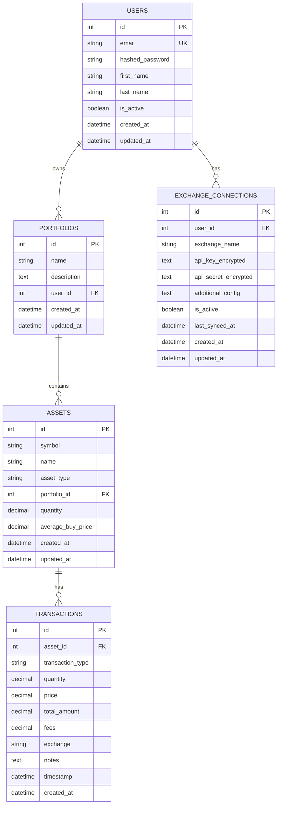

# Database Documentation

## Overview

The Money Maker application uses PostgreSQL as its primary database with SQLAlchemy as the ORM and Alembic for database migrations.

## Entity Relationship Diagram



## Table Descriptions

### users

Stores user account information.

| Column | Type | Description |
|--------|------|-------------|
| id | INTEGER PK | Unique identifier for the user |
| email | VARCHAR(255) UK | User's email address (unique) |
| hashed_password | VARCHAR(255) | Bcrypt-hashed password |
| first_name | VARCHAR(100) | User's first name (optional) |
| last_name | VARCHAR(100) | User's last name (optional) |
| is_active | BOOLEAN | Whether the account is active (default: true) |
| created_at | TIMESTAMP TZ | When the user was created |
| updated_at | TIMESTAMP TZ | When the user was last updated |

**Relationships:**
- One-to-Many with `portfolios` (cascade delete)
- One-to-Many with `exchange_connections` (cascade delete)

### portfolios

Represents a collection of assets owned by a user.

| Column | Type | Description |
|--------|------|-------------|
| id | INTEGER PK | Unique identifier |
| name | VARCHAR(255) | Portfolio name (required) |
| description | TEXT | Optional description |
| user_id | INTEGER FK | References users.id (cascade delete) |
| created_at | TIMESTAMP TZ | When created |
| updated_at | TIMESTAMP TZ | When last updated |

**Relationships:**
- Many-to-One with `users`
- One-to-Many with `assets` (cascade delete)

### assets

Represents a financial asset (stock, cryptocurrency, etc.) within a portfolio.

| Column | Type | Description |
|--------|------|-------------|
| id | INTEGER PK | Unique identifier |
| symbol | VARCHAR(50) | Asset ticker symbol (e.g., BTC, AAPL) |
| name | VARCHAR(255) | Full asset name |
| asset_type | VARCHAR(50) | Type: cryptocurrency, stock, bond, etc. |
| portfolio_id | INTEGER FK | References portfolios.id (cascade delete) |
| quantity | NUMERIC(20,8) | Total quantity held (default: 0) |
| average_buy_price | NUMERIC(20,8) | Average purchase price |
| created_at | TIMESTAMP TZ | When created |
| updated_at | TIMESTAMP TZ | When last updated |

**Relationships:**
- Many-to-One with `portfolios`
- One-to-Many with `transactions` (cascade delete)

### transactions

Records buy/sell transactions for assets.

| Column | Type | Description |
|--------|------|-------------|
| id | INTEGER PK | Unique identifier |
| asset_id | INTEGER FK | References assets.id (cascade delete) |
| transaction_type | VARCHAR(20) | Type: buy, sell, deposit, withdraw, dividend |
| quantity | NUMERIC(20,8) | Quantity transacted |
| price | NUMERIC(20,8) | Price per unit |
| total_amount | NUMERIC(20,2) | Total transaction value |
| fees | NUMERIC(20,2) | Transaction fees |
| exchange | VARCHAR(100) | Exchange where transaction occurred |
| notes | TEXT | Optional notes |
| timestamp | TIMESTAMP TZ | When transaction occurred |
| created_at | TIMESTAMP TZ | When record was created |

**Relationships:**
- Many-to-One with `assets`

### exchange_connections

Stores encrypted API credentials for external exchange integrations.

| Column | Type | Description |
|--------|------|-------------|
| id | INTEGER PK | Unique identifier |
| user_id | INTEGER FK | References users.id (cascade delete) |
| exchange_name | VARCHAR(100) | Exchange name (e.g., Coinbase, Binance) |
| api_key_encrypted | TEXT | Encrypted API key |
| api_secret_encrypted | TEXT | Encrypted API secret |
| additional_config | TEXT | Additional JSON configuration |
| is_active | BOOLEAN | Whether connection is active (default: true) |
| last_synced_at | TIMESTAMP TZ | Last successful sync timestamp |
| created_at | TIMESTAMP TZ | When created |
| updated_at | TIMESTAMP TZ | When last updated |

**Relationships:**
- Many-to-One with `users`

## Migration Instructions

### Initial Setup

1. Ensure PostgreSQL is running (via Docker Compose):
   ```bash
   docker compose up -d db
   ```

2. Run initial migration:
   ```bash
   alembic upgrade head
   ```

### Creating New Migrations

After modifying models, generate a new migration:

```bash
alembic revision --autogenerate -m "Description of changes"
```

Review the generated migration in `alembic/versions/` before applying.

### Applying Migrations

```bash
# Apply all pending migrations
alembic upgrade head

# Apply specific migration
alembic upgrade 001_initial_schema

# Rollback one migration
alembic downgrade -1

# Rollback to specific migration
alembic downgrade 001_initial_schema
```

### Migration Testing

Always test migrations before committing:

```bash
# Test upgrade
alembic upgrade head

# Test downgrade
alembic downgrade base

# Test upgrade again
alembic upgrade head
```

## Database Configuration

### Environment Variables

| Variable | Default | Description |
|----------|---------|-------------|
| DATABASE_URL | postgresql://postgres:postgres@db:5432/money_maker | Full database connection URL |
| DB_USER | postgres | Database username |
| DB_PASSWORD | postgres | Database password |
| DB_NAME | money_maker | Database name |

### Docker Compose Configuration

The database service is configured in `docker-compose.yml`:

```yaml
db:
  image: postgres:16-alpine
  environment:
    POSTGRES_USER: postgres
    POSTGRES_PASSWORD: postgres
    POSTGRES_DB: money_maker
  volumes:
    - postgres_data:/var/lib/postgresql/data
  ports:
    - "5432:5432"
```

## Performance Considerations

### Indexes

The following indexes are created automatically:

- `ix_users_id` on users.id
- `ix_users_email` on users.email (unique)
- `ix_portfolios_id` on portfolios.id
- `ix_exchange_connections_id` on exchange_connections.id
- `ix_assets_id` on assets.id
- `ix_assets_symbol` on assets.symbol
- `ix_transactions_id` on transactions.id

### Data Types

- Use `NUMERIC(precision, scale)` for monetary values to avoid floating-point errors
- Use `TIMESTAMP WITH TIME ZONE` for all datetime columns
- Use appropriate VARCHAR lengths to balance storage and flexibility

## Security Notes

- API keys and secrets are stored encrypted (encryption implementation TBD)
- Passwords are hashed using bcrypt (never store plaintext)
- Use parameterized queries to prevent SQL injection (SQLAlchemy handles this)
- Database connections use SSL in production (configure via DATABASE_URL)

## Backup and Restore

### Backup

```bash
docker exec money_maker_db pg_dump -U postgres money_maker > backup.sql
```

### Restore

```bash
docker exec -i money_maker_db psql -U postgres money_maker < backup.sql
```
